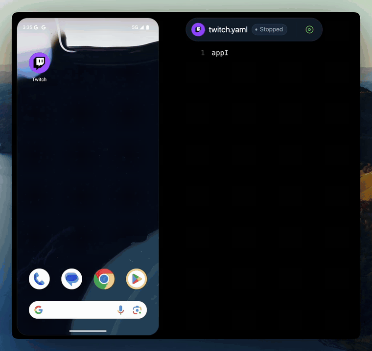
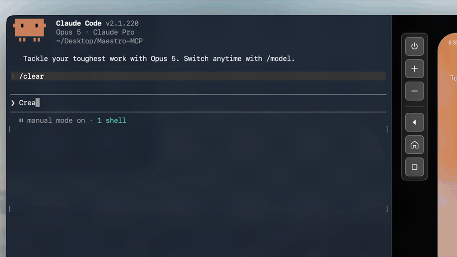

> [!TIP]
> Great things happen when testers connect — [Join the Maestro Community](https://maestrodev.typeform.com/to/FelIEe8A)


<p align="center">
  <a href="https://www.maestro.dev">
    
  </a>
</p>


**Maestro** is an open-source framework that makes UI and end-to-end testing for Android, iOS, and web apps simple and fast.

Hand-write your first YAML flow with the CLI in under 5 minutes, build flows visually in Maestro Studio, or add **Maestro MCP** to your coding agent for agentic UI testing.

Flows run on any emulator, simulator, browser, or physical Android device.

<p align="center">
  
</p>

&nbsp;

## Table of Contents

- [Why Maestro?](#why-maestro)
- [Getting Started](#getting-started)
- [Maestro MCP – Agentic UI Testing](#maestro-mcp--agentic-ui-testing)
- [Maestro Studio – Test IDE](#maestro-studio--test-ide)
- [Maestro Cloud – Parallel Execution & Scalability](#maestro-cloud--parallel-execution--scalability)
- [Resources & Community](#resources--community)
- [Contributing](#contributing)

&nbsp;

## Why Maestro?

Maestro is built on learnings from its predecessors (Appium, Espresso, UIAutomator, XCTest, Selenium, Playwright), plus 3 decisions made early: drive the app through the platform's accessibility layer, install as a single binary with no drivers or SDK, and keep every test a flat list of YAML commands.

- **Human-readable YAML flows** – express interactions as commands like `launchApp`, `tapOn`, and `assertVisible`.
- **Built for coding agents** – the Maestro MCP server ships inside the Maestro CLI (`maestro mcp`, nothing else to install). Claude Code, Cursor, Codex, Grok Build, or any MCP client can control your app on a live device: inspect the screen, tap, scroll, assert, and check its own work while it builds. Ask for a flow when you want a repeatable test — that's agentic UI testing.
- **Framework agnostic** – React Native, Flutter, native iOS and Android, Ionic, and hybrid apps all use the same commands. Meta uses Maestro to test React Native itself, and Expo supports Maestro as its preferred E2E testing platform.
- **Cross-platform coverage** – one flow syntax for Android, iOS, and web, on emulators, simulators, browsers, and physical Android devices.
- **Resilience & smart waiting** – built-in flakiness tolerance and automatic waiting handle dynamic UIs without manual `sleep()` calls.
- **Fast iteration & simple install** – one install line, no drivers, no SDK, no dependencies; flows are interpreted, so there's no compilation step. First test in 5 minutes.

**Simple Example:**
```
# flow_contacts_android.yaml

appId: com.android.contacts
---
- launchApp
- tapOn: "Create new contact"
- tapOn: "First Name"
- inputText: "John"
- tapOn: "Last Name"
- inputText: "Snow"
- tapOn: "Save"
```

&nbsp;

## Getting Started

Maestro requires Java 17 or higher to be installed on your system. You can verify your Java version by running:

```
java -version
```

Installing the CLI:

Run the following command to install Maestro on macOS, Linux or Windows (WSL):

```
curl -fsSL "https://get.maestro.mobile.dev" | bash
```

The links below will guide you through the next steps.

- [Installing Maestro](https://docs.maestro.dev/maestro-cli/how-to-install-maestro-cli) (includes regular Windows installation)
- [Add Maestro MCP to your coding agent](https://docs.maestro.dev/get-started/maestro-mcp)
- [Run your first test with the Maestro CLI](https://docs.maestro.dev/maestro-cli/run-your-first-test-with-the-maestro-cli) (or just ask your agent to do it for you)

&nbsp;

## Maestro MCP – Agentic UI Testing



Maestro MCP ships inside the Maestro CLI and works with Claude Code, Cursor, Codex, Gemini CLI, Copilot, Grok Build, or any MCP client. It gives your agent a live device (an emulator, simulator, or physical Android device), and Maestro Viewer embeds that device inside your coding agent, showing every MCP command as it runs.

With Maestro MCP, your agent can control the app directly: inspect the screen, tap, scroll, and assert. While it builds or changes a feature, it checks its own work on the device.

Your agent can also write tests. Ask for an end-to-end flow and it writes plain YAML, runs it until it passes, and the flow stays in your repo as a deterministic test for CI.

Setup for each coding agent is in the [Maestro MCP docs](https://docs.maestro.dev/get-started/maestro-mcp).

&nbsp;

## Maestro Studio – Test IDE

**Maestro Studio Desktop** is a lightweight IDE that lets you design and execute tests visually — no terminal needed. It is also free, even though Studio is not an open-source project. So you won't find the Maestro Studio code here.

- **Simple setup** – just download the native app for macOS, Windows, or Linux.
- **Visual flow builder & inspector** – record interactions, inspect elements, and build flows visually.

[Download Maestro Studio](https://maestro.dev/?utm_source=github-readme#maestro-studio)

&nbsp;

## [Maestro Cloud](https://maestro.dev/cloud?utm_source=github-readme) – Parallel Execution & Scalability

When your test suite grows, run hundreds of tests in parallel on dedicated infrastructure, cutting execution times by up to 90%. Includes built-in notifications, deterministic environments, and complete debugging tools.

Pricing for Maestro Cloud is completely transparent and can be found on the [pricing page](https://maestro.dev/pricing?utm_source=github-readme).

👉 [Start your free 7-day trial](https://maestro.dev/cloud?utm_source=github-readme)

&nbsp;

## Resources & Community

- 💬 [Join the Slack Community](https://maestrodev.typeform.com/to/FelIEe8A)
- 📘 [Documentation](https://docs.maestro.dev)
- 📰 [Blog](https://maestro.dev/blog?utm_source=github-readme)
- 🐦 [Follow us on X](https://twitter.com/maestro__dev)

&nbsp;

## Contributing

Maestro is open-source under the Apache 2.0 license — contributions are welcome!

- Check [good first issues](https://github.com/mobile-dev-inc/maestro/issues?q=is%3Aopen+is%3Aissue+label%3A%22good+first+issue%22)
- Read the [Contribution Guide](https://github.com/mobile-dev-inc/Maestro/blob/main/CONTRIBUTING.md)
- Fork, create a branch, and open a Pull Request.

If you find Maestro useful, ⭐ star the repository to support the project.


```
  Built with ❤️ by Maestro.dev
```
